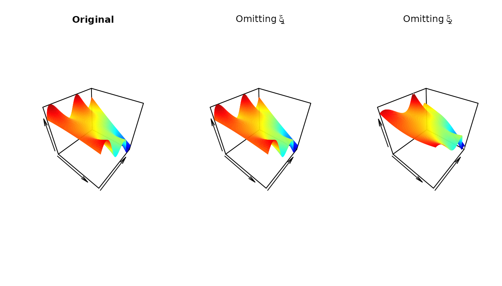
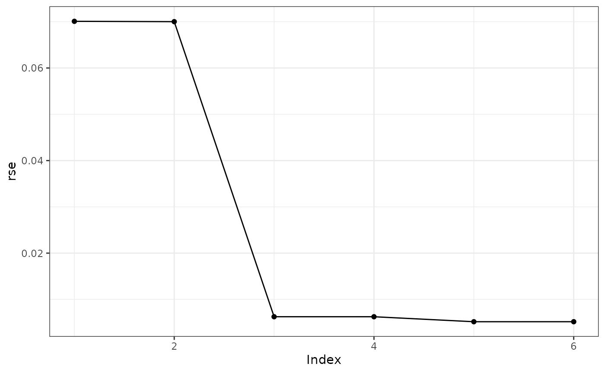

# Tensor Products of B-Splines, Control Nets, and Control Net Reduction

``` r
library(cpr)
packageVersion("cpr")
## [1] '0.4.0.9000'
```

The control polygon reduction methods for uni-variable functions can be
extended to multi-variable functions by generalizing control polygons to
control nets.

## Tensor Products of B-Splines

Where uni-variable functions of B-splines:

$$f(x) = \sum\limits_{j}\theta_{j}B_{j,k,{\mathbf{ξ}}}(x) = \mathbf{B}_{k,{\mathbf{ξ}}}(x){\mathbf{θ}}_{\mathbf{ξ}}$$

we extend to multi-variable $m$-dimensional B-spline function, built on
$m$ B-spline basis matrices
$\mathbf{B}_{k_{1},{\mathbf{ξ}}_{1}}\left( x_{1} \right),$$\mathbf{B}_{k_{2},{\mathbf{ξ}}_{2}}\left( x_{2} \right),\ldots,$$\mathbf{B}_{k_{m},{\mathbf{ξ}}_{m}}\left( x_{m} \right),$
as

$$f(\mathbf{X}) = \mathcal{B}_{\mathbf{K},\mathbf{\Xi}}(\mathbf{X}){\mathbf{θ}}_{\mathbf{\Xi}}$$

where $\mathbf{K} = \left\{ k_{1},k_{2},\ldots,k_{m} \right\},$ denotes
the set of polynomial orders,
$\mathbf{\Xi} = \left\{ {\mathbf{ξ}}_{1},{\mathbf{ξ}}_{2},\ldots,{\mathbf{ξ}}_{m} \right\}$
is the set of knot sequences, and ${\mathbf{θ}}_{\mathbf{\Xi}}$ is a
$\prod_{i = 1}^{m}\left( \left| {\mathbf{ξ}}_{i} \right| - k_{i} \right) \times 1$
column vector of regression coefficients, and $\mathbf{X}$ is the
observed data:

$$\mathbf{X} = \begin{pmatrix}
x_{11} & x_{21} & \cdots & x_{m1} \\
x_{12} & x_{22} & \cdots & x_{m2} \\
\vdots & \vdots & \ddots & \vdots \\
x_{12} & x_{22} & \cdots & x_{mn}
\end{pmatrix}.$$

The basis for multi-variable B-splines is constructed by a recursive
algorithm. The base case for $m = 2$ is
$$\mathcal{B}_{{\{ k_{1},k_{2}\}},{\{{\mathbf{ξ}}_{1},{\mathbf{ξ}}_{2}\}}}\left( \mathbf{x}_{1},\mathbf{x}_{2} \right) = \left( \mathbf{1}_{{|{\mathbf{ξ}}_{2}|} - k_{2}}^{T} \otimes \mathbf{B}_{k_{1},{\mathbf{ξ}}_{1}}\left( \mathbf{x}_{1} \right) \right) \odot \left( \mathbf{B}_{k_{2},{\mathbf{ξ}}_{2}}\left( \mathbf{x}_{2} \right) \otimes \mathbf{1}_{{|{\mathbf{ξ}}_{1}|} - k_{1}}^{T} \right),$$
where $\odot$ is the element-wise product, $\otimes$ is a Kronecker
product, and $\mathbf{1}_{n}$ is a $n \times 1$ column vector of 1s. The
two Kronecker products define the correct dimensions for the entry-wise
product. The tensor product matrix has the same number of rows as the
two input matrices and the columns are generated by all the pairwise
products of the columns of the two input matrices. The general case for
$m > 2,$ the matrix $\mathcal{B}_{\mathbf{K},\mathbf{\Xi}}(\mathbf{X})$
is defined by
$$\mathcal{B}_{\mathbf{K},\mathbf{\Xi}}(\mathbf{X}) = \left( \mathbf{1}_{{|{\mathbf{ξ}}_{m}|} - k_{m}}^{T} \otimes \mathcal{B}_{\mathbf{K} \smallsetminus k_{m},\mathbf{\Xi} \smallsetminus {\mathbf{ξ}}_{m}}\left( \mathbf{X} \smallsetminus \mathbf{x}_{m} \right) \right) \odot \left( \mathbf{B}_{k_{m},{\mathbf{ξ}}_{m}}\left( \mathbf{x}_{m} \right) \otimes \mathbf{1}_{\prod\limits_{i = 1}^{m - 1}{({|{\mathbf{ξ}}_{i}|} - k_{i})}}^{T} \right).$$

It is possible to write the above as a set of summations:
$$\begin{aligned}
{f(\mathbf{X})} & {= \mathcal{B}_{\mathbf{K},\mathbf{\Xi}}(\mathbf{X}){\mathbf{θ}}_{\mathbf{\Xi}}} \\
 & {= \sum\limits_{j_{1} = 1}^{{|{\mathbf{ξ}}_{1}|} - k_{1}}\sum\limits_{j_{2} = 1}^{{|{\mathbf{ξ}}_{2}|} - k_{2}}\cdots\sum\limits_{j_{m} = 1}^{{|{\mathbf{ξ}}_{m}|} - k_{m}}\mathbf{B}_{k_{1},{\mathbf{ξ}}_{1}}\left( \mathbf{x}_{1} \right)\mathbf{B}_{k_{2},{\mathbf{ξ}}_{2}}\left( \mathbf{x}_{2} \right)\cdots\mathbf{B}_{k_{m},{\mathbf{ξ}}_{m}}\left( \mathbf{x}_{m} \right)\theta_{\mathbf{\Xi},j_{1},j_{2},\ldots,j_{m}}} \\
 & {= \sum\limits_{j_{1} = 1}^{{|{\mathbf{ξ}}_{1}|} - k_{1}}\mathbf{B}_{k_{1},{\mathbf{ξ}}_{1}}\left( \mathbf{x}_{1} \right)\underset{\text{polynomial coefficients}}{\underbrace{\sum\limits_{j_{2} = 1}^{{|{\mathbf{ξ}}_{2}|} - k_{2}}\cdots\sum\limits_{j_{m} = 1}^{{|{\mathbf{ξ}}_{m}|} - k_{m}}\mathbf{B}_{k_{2},{\mathbf{ξ}}_{2}}\left( \mathbf{x}_{2} \right)\cdots\mathbf{B}_{k_{m},{\mathbf{ξ}}_{m}}\left( \mathbf{x}_{m} \right)\theta_{\mathbf{\Xi},j_{1},j_{2},\ldots,j_{m}}}}} \\
 & {= \text{diag}\left( \mathbf{B}_{k_{1},{\mathbf{ξ}}_{1}}\left( \mathbf{x}_{1} \right){\mathbf{θ}}_{\mathbf{\Xi} \smallsetminus {\mathbf{ξ}}_{1}}\left( \mathbf{X} \smallsetminus \mathbf{x}_{1} \right) \right).}
\end{aligned}$$ This is critical in the extension from the uni-variable
control polygon reduction method to the multi-variable control polygon
reduction method. By conditioning on $m - 1$ marginals, the
multi-variable B-spline becomes a uni-variable B-spline in terms of the
$m^{th}$ marginal. Thus, the metrics and methods of control polygon
reduction can be applied.

## Control Nets

For multi-variable B-splines, a meaningful geometric relationship
between the set of knot sequences, $\mathbf{\Xi},$ and regression
coefficients, ${\mathbf{θ}}_{\mathbf{\Xi}},$ is provided by a control
net. A control net for $m = 2$ variables would be:
$${CN}_{\mathbf{K} = {\{ k_{1},k_{2}\}},\mathbf{\Xi} = {\{{\mathbf{ξ}}_{1},{\mathbf{ξ}}_{2}\}},{\mathbf{θ}}_{\mathbf{\Xi}}} = \left\{ \left( \xi_{1i}^{*},\xi_{2j}^{*},\theta_{ij} \right) \right\}_{i = 1,j = 1}^{{|{\mathbf{ξ}}_{1}|} - k_{1},{|{\mathbf{ξ}}_{2}|} - k_{2}},\quad\xi_{lj}^{*} = \frac{1}{k_{l} + 1}\sum\limits_{i = 1}^{k_{l} - 1}\xi_{l,j + i}.$$

Building a control net in the cpr package is done by calling the `cn`
function after defining a basis via the `btensor` method.

Define a tensor product of B-splines by providing a list of vectors,
iknots, bknots, and orders.

``` r
tpmat <-
  btensor(x = list(x1 = runif(51), x2 = runif(51)),
          iknots = list(numeric(0), c(0.418, 0.582, 0.676, 0.840)),
          bknots = list(c(0, 1), c(0, 1)),
          order = list(3, 4))
tpmat
## Tensor Product Matrix dims: [51 x 24]
```

An example of a control net and the surface it produces:

``` r
theta <-
  c(-0.03760,  0.03760, -0.03760,  0.77579, -0.84546,  0.63644, -0.87674,
     0.71007, -1.21007,  0.29655, -0.57582, -0.26198,  0.23632, -0.58583,
    -0.46271, -0.39724, -0.02194, -1.23562, -0.19377, -0.27948, -1.14028,
     0.00405, -0.50405, -0.99595)

acn <- cn(tpmat, theta)
```

``` r
par(mfrow = c(1, 2))
plot(acn, rgl = FALSE, xlab = "x1", ylab = "x2", zlab = "control net", clim = c(-1.2, 0.3), colkey = FALSE)
## Warning in rgl.init(initValue, onlyNULL): RGL: unable to open X11 display
## Warning: 'rgl.init' failed, will use the null device.
## See '?rgl.useNULL' for ways to avoid this warning.
## Warning: no DISPLAY variable so Tk is not available
plot(acn, rgl = FALSE, show_net = FALSE, show_surface = TRUE, xlab = "x1", ylab = "x2", zlab = "surface", clim = c(-1.2, 0.3))
```


## Control Net Reduction

Similar to control polygon reduction (CPR), control net reduction (CNR)
looks assesses the influence of each internal knot, omits the least
influential, refits the model, and repeats. A complication for CNR is
that the influence of an internal knot on margin $m$ is a function of
the locations values of $x$ on the other margins defining the polynomial
coefficients. We suggest using a set of $p = 20$ values on each margin
for assessment.

For example in a two-variable tensor product, the influence weight of
the $j^{th}$ internal knot for the first margin is

$$w_{1j} = \max\limits_{x_{2} \in \mathbf{U}}w_{{1j|}x_{2}},$$ where
$$\mathbf{U} = \left\{ u:\min\left( x_{2} \right) + \frac{\left\{ 1,2,\ldots,p \right\}}{p + 1}\left( \max\left( x_{2} \right) - \min\left( x_{2} \right) \right) \right\}$$

For example:

``` r
f <- function(x1, x2) {(x1 - 0.5)^2 * sin(4 * pi * x2) - x1 * x2}
set.seed(42)
cn_data <- expand.grid(x1 = sort(runif(100)), x2 = sort(runif(100)))
cn_data <- within(cn_data, {z = f(x1, x2)})
initial_cn <-
  cn(z ~ btensor(x        = list(x1, x2)
                 , iknots = list(c(0.234), c(0.418, 0.582, 0.676, 0.840))
                 , bknots = list(c(0, 1), c(0, 1))
                 , order  = list(3, 4)
                 )
     , data = cn_data)
## Warning: the 'nobars' function has moved to the reformulas package. Please update your imports, or ask an upstream package maintainter to do so.
## This warning is displayed once per session.

influence_of_iknots(initial_cn)
## [[1]]
##         xi_4 
## 4.010166e-32 
## 
## [[2]]
##        xi_5        xi_6        xi_7        xi_8 
## 0.717424005 0.045575415 0.006775287 0.012875249 
## 
## attr(,"class")
## [1] "cpr_influence_of_iknots_cpn" "list"
```

The least influential knot is $\xi_{1,4}$ and the most influential knot
is $\xi_{2,5}.$

``` r
cn1 <- update_btensor(initial_cn, iknots = list(numeric(0), c(0.418, 0.582, 0.676, 0.840)))
cn2 <- update_btensor(initial_cn, iknots = list(numeric(0.234), c(0.582, 0.676, 0.840)))
```

``` r
par(mfrow = c(1, 3))
plot(initial_cn, rgl = FALSE, show_surface = TRUE, show_net = FALSE, colkey = FALSE, clim = c(-1.2, 0.3), main = "Original")
plot(cn1,        rgl = FALSE, show_surface = TRUE, show_net = FALSE, colkey = FALSE, clim = c(-1.2, 0.3), main = bquote(Omitting~xi[1,1]))
plot(cn2,        rgl = FALSE, show_surface = TRUE, show_net = FALSE, colkey = FALSE, clim = c(-1.2, 0.3), main = bquote(Omitting~xi[2,1]))
```



A call to `cnr` runs the full CNR algorithm on an initial control net.

``` r
cnr0 <- cnr(initial_cn)
##   |                                                                              |                                                                      |   0%  |                                                                              |============                                                          |  17%  |                                                                              |=======================                                               |  33%  |                                                                              |===================================                                   |  50%  |                                                                              |===============================================                       |  67%  |                                                                              |==========================================================            |  83%  |                                                                              |======================================================================| 100%
summary(cnr0)
##   dfs   loglik        rss         rse n_iknots1 iknots1 n_iknots2      iknots2
## 1  12 12396.78 49.0631393 0.070087150         0                 0             
## 2  15 12408.53 48.9479832 0.070015367         0                 1        0.582
## 3  18 36554.82  0.3912139 0.006260346         0                 2 0.418, 0.582
## 4  21 36559.88  0.3908179 0.006258118         0                 3 0.418, 0....
## 5  24 38449.23  0.2678356 0.005181505         0                 4 0.418, 0....
## 6  32 38449.23  0.2678356 0.005183584         1   0.234         4 0.418, 0....
##   index
## 1     1
## 2     2
## 3     3
## 4     4
## 5     5
## 6     6
plot(cnr0)
```



The plot of the residual standard errors by index shows index 3 is the
preferable model. We can look at all the surfaces and see there is
little difference from the original (index 6) through index 3 with
considerable differences in the surfaces for index 1 and 2.

``` r
par(mfrow = c(2, 3))
plot(cnr0[[1]], rgl = FALSE, show_surface = TRUE, show_net = FALSE, clim = c(-1.2, 0.3), main = "Index 1", colkey = FALSE)
plot(cnr0[[2]], rgl = FALSE, show_surface = TRUE, show_net = FALSE, clim = c(-1.2, 0.3), main = "Index 2", colkey = FALSE)
plot(cnr0[[3]], rgl = FALSE, show_surface = TRUE, show_net = FALSE, clim = c(-1.2, 0.3), main = "Index 3", colkey = FALSE)
plot(cnr0[[4]], rgl = FALSE, show_surface = TRUE, show_net = FALSE, clim = c(-1.2, 0.3), main = "Index 4", colkey = FALSE)
plot(cnr0[[5]], rgl = FALSE, show_surface = TRUE, show_net = FALSE, clim = c(-1.2, 0.3), main = "Index 5", colkey = FALSE)
plot(cnr0[[6]], rgl = FALSE, show_surface = TRUE, show_net = FALSE, clim = c(-1.2, 0.3), main = "Index 6", colkey = FALSE)
```


## References

## Session Info

``` r
sessionInfo()
## R version 4.5.2 (2025-10-31)
## Platform: x86_64-pc-linux-gnu
## Running under: Ubuntu 24.04.3 LTS
## 
## Matrix products: default
## BLAS:   /usr/lib/x86_64-linux-gnu/openblas-pthread/libblas.so.3 
## LAPACK: /usr/lib/x86_64-linux-gnu/openblas-pthread/libopenblasp-r0.3.26.so;  LAPACK version 3.12.0
## 
## locale:
##  [1] LC_CTYPE=C.UTF-8       LC_NUMERIC=C           LC_TIME=C.UTF-8       
##  [4] LC_COLLATE=C.UTF-8     LC_MONETARY=C.UTF-8    LC_MESSAGES=C.UTF-8   
##  [7] LC_PAPER=C.UTF-8       LC_NAME=C              LC_ADDRESS=C          
## [10] LC_TELEPHONE=C         LC_MEASUREMENT=C.UTF-8 LC_IDENTIFICATION=C   
## 
## time zone: UTC
## tzcode source: system (glibc)
## 
## attached base packages:
## [1] stats     graphics  grDevices utils     datasets  methods   base     
## 
## other attached packages:
## [1] cpr_0.4.0.9000 qwraps2_0.6.1 
## 
## loaded via a namespace (and not attached):
##  [1] sass_0.4.10        generics_0.1.4     tcltk_4.5.2        lattice_0.22-7    
##  [5] lme4_1.1-38        digest_0.6.39      magrittr_2.0.4     rgl_1.3.31        
##  [9] evaluate_1.0.5     grid_4.5.2         RColorBrewer_1.1-3 fastmap_1.2.0     
## [13] jsonlite_2.0.0     Matrix_1.7-4       misc3d_0.9-1       scales_1.4.0      
## [17] textshaping_1.0.4  jquerylib_0.1.4    reformulas_0.4.3   Rdpack_2.6.4      
## [21] cli_3.6.5          rlang_1.1.6        rbibutils_2.4      splines_4.5.2     
## [25] withr_3.0.2        base64enc_0.1-3    cachem_1.1.0       yaml_2.3.12       
## [29] tools_4.5.2        nloptr_2.2.1       minqa_1.2.8        dplyr_1.1.4       
## [33] ggplot2_4.0.1      boot_1.3-32        vctrs_0.6.5        R6_2.6.1          
## [37] lifecycle_1.0.4    plot3D_1.4.2       fs_1.6.6           htmlwidgets_1.6.4 
## [41] MASS_7.3-65        ragg_1.5.0         pkgconfig_2.0.3    desc_1.4.3        
## [45] pkgdown_2.2.0      bslib_0.9.0        pillar_1.11.1      gtable_0.3.6      
## [49] glue_1.8.0         Rcpp_1.1.0         systemfonts_1.3.1  tidyselect_1.2.1  
## [53] tibble_3.3.0       xfun_0.55          knitr_1.51         farver_2.1.2      
## [57] htmltools_0.5.9    nlme_3.1-168       labeling_0.4.3     rmarkdown_2.30    
## [61] compiler_4.5.2     S7_0.2.1
```
