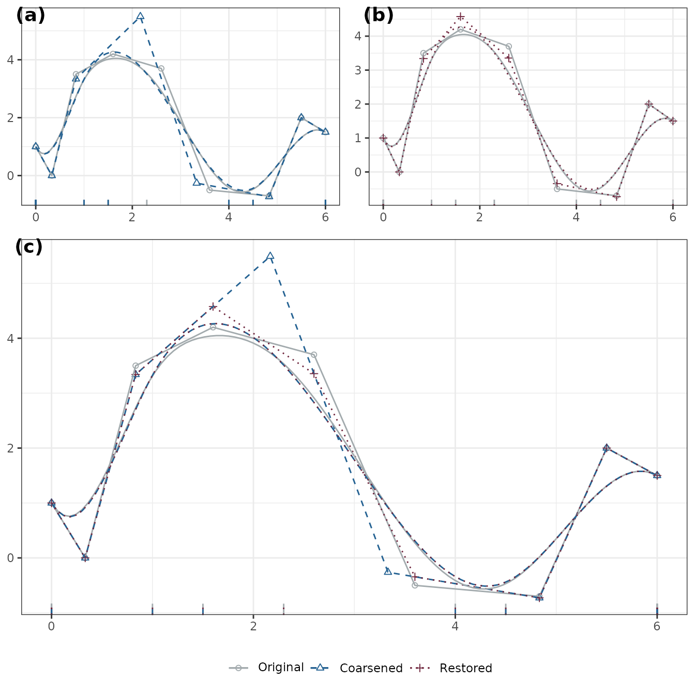

# Control Polygon Reduction

``` r
library(cpr)
packageVersion("cpr")
## [1] '0.4.1'
```

The purpose of this vignette is to illustrate how the Control Polygon
Reduction (CPR) method can be used to select a set of knots defining
B-spline to get low degrees of freedom and a smooth fit to the data. We
start with a primer on B-splines and control polygons then the
development and use of CPR.

## B-splines and Control Polygons

The term “spline” is likely derived from shipwright or draftsmen
splines, thin wood strips, held in place by weights, used to define
curves. These splines naturally minimize strain energy and the use of
additional weights at strategic locations on the spline is needed to
achieve specific curvatures. Cubic B-splines are not dissimilar.

Splines are piecewise polynomial curves that are differentiable up to a
prescribed order. B-splines are based on a *basis* of polynomial
functions.

Definitions and notation for univariate and multivariate B-splines and
the associated control polygons and control nets are presented in the
following. Two very good references for splines are de Boor (2001) and
Prautzsch, Boehm, and Paluszny (2002) if you wish to dig into the
details.

### B-splines

A curve defined by $f(x)$ is a spline of order $k$ (degree $k - 1$),
with knots $\xi_{1},\xi_{2},\ldots,\xi_{m}$ where
$\xi_{j} \leq x_{j + 1}$ and $\xi_{j} < \xi_{j + k}\forall j$ if $f(x)$
is $k - r - 1$ times differentiable at any $r$-fold knot, and $f(x)$ is
a polynomial of order $\leq k$ over each interval
$x \in \left\lbrack \xi_{j},\xi_{j + 1} \right\rbrack$ for
$j = 0,\ldots,m - 1.$

In particular, B-splines are defined as an affine combination:

$$f(x) = \sum\limits_{j}\theta_{j}B_{j,k,{\mathbf{ξ}}}(x) = \mathbf{B}_{k,{\mathbf{ξ}}}(x){\mathbf{θ}}_{\mathbf{ξ}}$$

where $B_{j,k,{\mathbf{ξ}}}(x)$ is the $j^{th}$ basis spline function,
$\mathbf{ξ}$ is a sequence of $l$ interior knots and a total of $2k$
boundary knots, i.e., the cardinality of the knot sequence is
$|{\mathbf{ξ}}| = 2k + l.$ The value of the $k$ boundary knots is
arbitrary, but a common choice is to use $k$-fold knots on the boundary:

$$\xi_{1} = \xi_{2} = \cdots = \xi_{k} < \xi_{k + 1} \leq \cdots \leq \xi_{k + l} = \xi_{k + l + 1} = \cdots = \xi_{2k + l}.$$

Alternative boundary knots can be used so long as the sequence
$\mathbf{ξ}$ is non-decreasing. More on the implications of $k$-fold
boundary knots follow in the next section.

The $j^{th}$ B-spline is defined as:

$$B_{j,k,{\mathbf{ξ}}}(x) = \omega_{j,k,{\mathbf{ξ}}}(x)B_{j,k - 1,{\mathbf{ξ}}}(x) + \left( 1 - \omega_{j + 1,k,{\mathbf{ξ}}} \right)B_{j + 1,k - 1,{\mathbf{ξ}}}(x),$$
where
$$B_{j,k,{\mathbf{ξ}}}(x) = 0\quad\text{for}\quad x \notin \left\lbrack \xi_{j},\xi_{j + k} \right),\quad\quad B_{j,1,{\mathbf{ξ}}}(x) = \begin{cases}
1 & {x \in \left\lbrack \xi_{j},\xi_{j + k} \right)} \\
0 & {\text{otherwise},}
\end{cases}$$ and $$\omega_{j,k,{\mathbf{ξ}}}(x) = \begin{cases}
0 & {x \leq \xi_{j}} \\
\frac{x - \xi_{j}}{\xi_{j + k - 1} - \xi_{j}} & {\xi_{j} < x < \xi_{j + k - 1}} \\
1 & {\xi_{j + k - 1} \leq x.}
\end{cases}$$

For a set of observations, $\mathbf{x} = x_{1},\ldots,x_{n},$ the basis
functions defined above generalize to a matrix:

$$\mathbf{B}_{k,{\mathbf{ξ}}}(\mathbf{x}) = \begin{pmatrix}
{B_{1,k,{\mathbf{ξ}}}\left( x_{1} \right)} & {B_{2,k,{\mathbf{ξ}}}\left( x_{1} \right)} & \ldots & {B_{k + l,k,{\mathbf{ξ}}}\left( x_{1} \right)} \\
\vdots & \vdots & \ddots & \vdots \\
{B_{1,k,{\mathbf{ξ}}}\left( x_{n} \right)} & {B_{2,k,{\mathbf{ξ}}}\left( x_{n} \right)} & \ldots & {B_{k + l,k,{\mathbf{ξ}}}\left( x_{n} \right).}
\end{pmatrix}$$

Within the cpr package we can generate a basis matrix as follows:

``` r
x <- seq(0, 5.9999, length.out = 5000)
bmat <- bsplines(x, iknots = c(1, 1.5, 2.3, 4, 4.5), bknots = c(0, 6))
bmat
## Basis matrix dims: [5,000 x 9]
## Order: 4
## Number of internal knots: 5
## 
## First 6 rows:
## 
##           [,1]        [,2]         [,3]         [,4] [,5] [,6] [,7] [,8] [,9]
## [1,] 1.0000000 0.000000000 0.000000e+00 0.000000e+00    0    0    0    0    0
## [2,] 0.9964037 0.003593461 2.878634e-06 5.011451e-10    0    0    0    0    0
## [3,] 0.9928160 0.007172539 1.150485e-05 4.009161e-09    0    0    0    0    0
## [4,] 0.9892369 0.010737255 2.586411e-05 1.353092e-08    0    0    0    0    0
## [5,] 0.9856664 0.014287632 4.594188e-05 3.207329e-08    0    0    0    0    0
## [6,] 0.9821045 0.017823691 7.172363e-05 6.264314e-08    0    0    0    0    0
```

Note: the default order for
[`bsplines()`](http://www.peteredewitt.com/cpr/reference/bsplines.md) is
4, and the default for the boundary knots is the range of `x`. However,
relying on the default boundary knots can lead to unexpected behavior
because, by definition, the spline values on the $k$-fold upper boundary
are 0.

We can quickly view the plot of each of these spline functions as well.

``` r
plot(bmat, show_xi = TRUE, show_x = TRUE)
```


A few of many important properties of the basis functions:

$$B_{j,k,{\mathbf{x}\mathbf{i}}}(x) \in \lbrack 0,1\rbrack,\forall x \in {\mathbb{R}};$$

``` r
all(bmat >= 0)
## [1] TRUE
all(bmat <= 1)
## [1] TRUE
```

$$B_{j,k,{\mathbf{ξ}}}(x) > 0\quad\text{for}\quad x \in \left( \xi_{j},\xi_{j + k} \right);$$

and

$$\sum\limits_{j}B_{j,k,{\mathbf{x}\mathbf{i}}}(x) = \begin{cases}
1 & {x \in \left\lbrack \xi_{1},\xi_{2k + l} \right)} \\
0 & {otherwise.}
\end{cases}$$

``` r
all.equal(rowSums(bmat), rep(1, nrow(bmat)))
## [1] TRUE
```

#### cpr::bsplines vs splines::bs

Part of the base R distribution is the splines package which builds
B-splines by calling `bs()`. There are three areas where the functions
differ: 1. input arguments, 2. attributes of the returned matrix, and 3.
behavior at the right boundary knot.

##### Input Arguments

``` r
args(bsplines)
## function (x, iknots = NULL, df = NULL, bknots = range(x), order = 4L) 
## NULL
args(splines::bs)
## function (x, df = NULL, knots = NULL, degree = 3, intercept = FALSE, 
##     Boundary.knots = range(x), warn.outside = TRUE) 
## NULL
```

| cpr::bsplines | splines::bs    | Notes                                    |
|:--------------|:---------------|:-----------------------------------------|
| x             | x              | numeric vector; the predictor variable   |
| iknots        | knots          | internal knots                           |
| bknots        | Boundary.knots | boundary knots                           |
| order         | degree         | polynomial order = polynomial degree + 1 |
| df            | df             | degrees of freedom                       |
|               | intercept      |                                          |
|               | warn.outside   |                                          |

[`bsplines()`](http://www.peteredewitt.com/cpr/reference/bsplines.md)
does not have the `intercept` nor the `warn.outside` arguments because
the matrix generated by
[`bsplines()`](http://www.peteredewitt.com/cpr/reference/bsplines.md)
effectively *always* has `intercept = TRUE` and `warn.outside = TRUE`.
How values of `x` at the right boundary, and outside the boundary are
treated also differ between the two functions.

##### Attributes of the returned matrices

The default call for both B-spline functions returns a basis matrix for
a order 4 (degree 3; cubic) B-spline with boundary knots placed at
`range(x)`. However, the returns are not the same.

``` r
bs_mat <- splines::bs(x, knots = attr(bmat, "iknots"), Boundary.knots = attr(bmat, "bknots"))
str(attributes(bmat))
## List of 10
##  $ dim        : int [1:2] 5000 9
##  $ order      : num 4
##  $ df         : num 9
##  $ iknots     : num [1:5] 1 1.5 2.3 4 4.5
##  $ bknots     : num [1:2] 0 6
##  $ xi         : num [1:13] 0 0 0 0 1 1.5 2.3 4 4.5 6 ...
##  $ xi_star    : num [1:9] 0 0.333 0.833 1.6 2.6 ...
##  $ class      : chr [1:2] "cpr_bs" "matrix"
##  $ call       : language bsplines(x = x, iknots = c(1, 1.5, 2.3, 4, 4.5), bknots = c(0, 6))
##  $ environment:<environment: R_GlobalEnv>
str(attributes(bs_mat))
## List of 7
##  $ dim           : int [1:2] 5000 8
##  $ dimnames      :List of 2
##   ..$ : NULL
##   ..$ : chr [1:8] "1" "2" "3" "4" ...
##  $ degree        : int 3
##  $ knots         : num [1:5] 1 1.5 2.3 4 4.5
##  $ Boundary.knots: num [1:2] 0 6
##  $ intercept     : logi FALSE
##  $ class         : chr [1:3] "bs" "basis" "matrix"
```

The `bspline_mat` has additional attributes related to the control
polygons.

The major difference is in the dimensions of the matrices. By default
[`splines::bs()`](https://rdrr.io/r/splines/bs.html) omits one column
from the basis matrix such that when using the function is a regression
formula the resulting design matrix is not rank deficient. Using
[`bsplines()`](http://www.peteredewitt.com/cpr/reference/bsplines.md)
would suggest using a `+0` or `-1` in the regression formula to omit the
intercept (this nuance is handled in calls to
[`cp()`](http://www.peteredewitt.com/cpr/reference/cp.md) so the end
user need not worry about it).

##### Right Continuity

By definition, the $\mathbf{B}_{j,k,{\mathbf{ξ}}}(x)$ are non-negative
right-continuous functions.
[`bsplines()`](http://www.peteredewitt.com/cpr/reference/bsplines.md)
adheres to the definition strictly, whereas
[`splines::bs()`](https://rdrr.io/r/splines/bs.html) uses a pivoting
method to allow for non-zero extrapolations outside the support.

Example: for the
[`cpr::bsplines()`](http://www.peteredewitt.com/cpr/reference/bsplines.md)
call, notice that the first, third, and fifth rows, corresponding to
values outside the support are all zeros as are the row sums. Compare
that to the [`splines::bs()`](https://rdrr.io/r/splines/bs.html) which
returns negative values and in the matrix, and all rows sum to 1.

``` r
bspline_eg <- bsplines(c(0, 1, 2, 5, 6), bknots = c(1, 5))
## Warning in bsplines(c(0, 1, 2, 5, 6), bknots = c(1, 5)): At least one x value <
## min(bknots)
## Warning in bsplines(c(0, 1, 2, 5, 6), bknots = c(1, 5)): At least one x value
## >= max(bknots)
bs_eg      <- splines::bs(c(0, 1, 2, 5, 6), Boundary.knots = c(1, 5), intercept = TRUE )
## Warning in splines::bs(c(0, 1, 2, 5, 6), Boundary.knots = c(1, 5), intercept =
## TRUE): some 'x' values beyond boundary knots may cause ill-conditioned bases

head(bspline_eg)
##          [,1]     [,2]     [,3]     [,4]
## [1,] 0.000000 0.000000 0.000000 0.000000
## [2,] 1.000000 0.000000 0.000000 0.000000
## [3,] 0.421875 0.421875 0.140625 0.015625
## [4,] 0.000000 0.000000 0.000000 0.000000
## [5,] 0.000000 0.000000 0.000000 0.000000
rowSums(bspline_eg)
## [1] 0 1 1 0 0

head(bs_eg)
##              1         2         3         4
## [1,]  1.953125 -1.171875  0.234375 -0.015625
## [2,]  1.000000  0.000000  0.000000  0.000000
## [3,]  0.421875  0.421875  0.140625  0.015625
## [4,]  0.000000  0.000000  0.000000  1.000000
## [5,] -0.015625  0.234375 -1.171875  1.953125
rowSums(bs_eg)
## [1] 1 1 1 1 1
```

## Control Polygons

The spline $f(\mathbf{x}) = \mathbf{B}_{k,{\mathbf{ξ}}}(\mathbf{x})$ is
a convex sum of the coefficients ${\mathbf{θ}}_{\mathbf{ξ}}.$ A
meaningful geometric relationship between $\mathbf{ξ}$ and
${\mathbf{θ}}_{\mathbf{ξ}}$ exist in the form of a **control polygon**,
$CP_{k,{\mathbf{ξ}},{\mathbf{θ}}_{\mathbf{ξ}}},$ a strong convex hull
for $\mathbf{B}_{k,{\mathbf{ξ}}}(\mathbf{x}){\mathbf{θ}}_{\mathbf{ξ}}.$

$$CP_{k,{\mathbf{ξ}},{\mathbf{θ}}_{\xi}} = \left\{ \left( \xi_{j}^{*},\theta_{j,{\mathbf{ξ}}} \right) \right\}_{j = 1}^{|{\mathbf{θ}}_{\mathbf{ξ}}|};\quad\quad\xi_{j}^{*} = \frac{1}{k - 1}\sum\limits_{i = 1}^{k - 1}\xi_{j + i}.$$

$CP_{k,{\mathbf{ξ}},{\mathbf{θ}}_{\mathbf{ξ}}}$ is a sequence of
$\left| {\mathbf{θ}}_{\mathbf{ξ}} \right| = k + l$ control vertices. The
control polygon can be thought of as a piecewise linear function
approximating the spline function. Changes in convexity and other subtle
characteristics of the spline function are exaggerated by the control
polygon.

For example, using the basis matrix defined above and the following
coefficients we can easily define a spline function and control polygon.

``` r
theta <- matrix(c(1, 0, 3.5, 4.2, 3.7, -0.5, -0.7, 2, 1.5), ncol = 1)
cp0 <- cp(bmat, theta)
```

Plotting the control polygon and the corresponding spline:

``` r
plot(cp0, show_spline = TRUE)
```


## Knot Influence

### Spline Spaces and Inserting a Knot

Consider two knot sequences $\mathbf{ξ}$ and
${\mathbf{ξ}} \cup {\mathbf{ξ}}\prime.$ Then, for a given polynomial
order $k,$ the spline space
${\mathbb{S}}_{k,{\mathbf{ξ}}} \subset {\mathbb{S}}_{k,{\mathbf{ξ}} \cup {\mathbf{ξ}}\prime}$(de
Boor 2001, pg135). Given this relationship between spline spaces, and
the convex sums generating spline functions, Boehm (1980) presented a
method for inserting a knots into the knot sequence such that the spline
function is unchanged. Specifically, for
$${\mathbf{ξ}}\prime = \left\{ \left. \xi_{j}\prime \right|\min({\mathbf{ξ}}) < \xi_{j} < \max({\mathbf{ξ}})\quad\forall j \right\},$$
then there exist a ${\mathbf{θ}}_{{\mathbf{ξ}} \cup {\mathbf{ξ}}\prime}$
such that
$$\mathbf{B}_{k,{\mathbf{ξ}}}(x){\mathbf{θ}}_{\mathbf{ξ}} = \mathbf{B}_{k,{\mathbf{ξ}} \cup {\mathbf{ξ}}\prime}(x){\mathbf{θ}}_{{\mathbf{ξ}} \cup {\mathbf{ξ}}\prime}\quad\forall x \in \left\lbrack \min({\mathbf{ξ}}),\max({\mathbf{ξ}}) \right\rbrack.$$

When inserting a singleton $\xi\prime$ into ${\mathbf{ξ}},$ then
$${\mathbf{θ}}_{{\mathbf{ξ}} \cup \xi\prime} = \mathbf{W}_{k,{\mathbf{ξ}}}(\xi\prime){\mathbf{θ}}_{\mathbf{ξ}}$$
where $\mathbf{W}_{k,{\mathbf{ξ}}}(\xi\prime)$ is a
$\left( |{\mathbf{θ}}| + 1 \right) \times |{\mathbf{θ}}|$ lower
bi-diagonal matrix
$$\mathbf{W}_{k,{\mathbf{ξ}}}(\xi\prime) = \begin{pmatrix}
1 & 0 & \cdots & 0 \\
{1 - \omega_{1,k,{\mathbf{ξ}}}(\xi\prime)} & {\omega_{1,k,{\mathbf{ξ}}}(\xi\prime)} & \cdots & 0 \\
0 & {1 - \omega_{2,k,{\mathbf{ξ}}}(\xi\prime)} & {\cdots 0} & \\
\vdots & \vdots & \ddots & \vdots \\
0 & 0 & {1 - \omega_{{|{\mathbf{θ}}|} - 1,k,{\mathbf{ξ}}}(\xi\prime)} & {\omega_{{|{\mathbf{θ}}|} - 1,k,{\mathbf{ξ}}}(\xi\prime)} \\
0 & 0 & 0 & 1
\end{pmatrix},$$ with $\omega_{j,k,{\mathbf{ξ}}}(x)$ as defined above in
the de~Boor recursive algorithm. Through recursion we can insert as many
knots into $\mathbf{ξ}$ without changing the value of the spline
function.

For an example, insert a knot $\xi\prime = 3$ into the control polygon
defined above.

``` r
cp1 <- insert_a_knot(cp0, xi_prime = 3)
plot(cp0, cp1, color = TRUE, show_spline = TRUE)
## Warning: Removed 27 rows containing missing values or values outside the scale range
## (`geom_rug()`).
```


### Assessing influence of $\xi_{j}$

Here we derive a metric for assessing how much influence
$\xi_{j} \in {\mathbf{ξ}}$ has on
$\mathbf{B}_{k,{\mathbf{ξ}}}(x){\mathbf{θ}}_{\mathbf{ξ}}.$ Using the
relationship defined by Boehm (1980), we can derive a metric for the
influence of $\xi_{j}$ on the spline function.

Start with an defined $k,{\mathbf{ξ}},$ and
${\mathbf{θ}}_{k,{\mathbf{ξ}}}.$ The relationship
$${\mathbf{θ}}_{\mathbf{ξ}} = \mathbf{W}_{k,{\mathbf{ξ}} \smallsetminus \xi_{j}}\left( \xi_{j} \right){\mathbf{θ}}_{{\mathbf{ξ}} \smallsetminus \xi_{j}}$$
holds if $\xi_{j}$ has zero influence. However, in practice, we would
expect that the relationship is
$${\mathbf{θ}}_{\mathbf{ξ}} = \mathbf{W}_{k,{\mathbf{ξ}} \smallsetminus \xi_{j}}\left( \xi_{j} \right){\mathbf{θ}}_{{\mathbf{ξ}} \smallsetminus \xi_{j}} + \mathbf{d}$$
for a set of deviations $\mathbf{d}$ which would be equal to
$\mathbf{0}$ if $\xi_{j}$ has no influence on the spline.

We can estimate $\mathbf{d}$ via least squares. To simplify the notation
in the following we drop some of the subscripts and parenthesis, that
is, let
$\mathbf{W} = \mathbf{W}_{k,{\mathbf{ξ}} \smallsetminus \xi_{j}}\left( \xi_{j} \right).$

$$\begin{aligned}
\mathbf{d} & {= {\mathbf{θ}}_{\mathbf{ξ}} - \mathbf{W}{\mathbf{θ}}_{{\mathbf{ξ}} \smallsetminus \xi_{j}}} \\
 & {= {\mathbf{θ}}_{\mathbf{ξ}} - \mathbf{W}\left( \mathbf{W}^{T}\mathbf{W} \right)^{- 1}\mathbf{W}^{T}{\mathbf{θ}}_{\mathbf{ξ}}} \\
 & {= \left( \mathbf{I} - \mathbf{W}\left( \mathbf{W}^{T}\mathbf{W} \right)^{- 1}\mathbf{W}^{T} \right){\mathbf{θ}}_{\mathbf{ξ}}} \\
 & 
\end{aligned}$$

Finally, we define the influence of $\xi_{j}$ on
$CP_{k,{\mathbf{ξ}},{\mathbf{θ}}_{\mathbf{ξ}}}$ as
$$w_{j} = \left. \parallel\mathbf{d}\parallel \right._{2}^{2}.$$

The influence of knots on the spline used in the above section.

``` r
x <- influence_of_iknots(cp0)
summary(x)
##   j iknot  influence influence_rank chisq chisq_rank p_value os_p_value
## 1 5   1.0 1.64661178              5    NA         NA      NA         NA
## 2 6   1.5 0.29066719              2    NA         NA      NA         NA
## 3 7   2.3 0.31205029              3    NA         NA      NA         NA
## 4 8   4.0 0.07702981              1    NA         NA      NA         NA
## 5 9   4.5 0.41987740              4    NA         NA      NA         NA
```

Let’s look at the following plots to explore the influence of $\xi_{7}$
(the third interior knot in a $k = 4$ order spline) on the spline. In
panel (a) we see the original control polygon and spline along with the
coarsened control polygon and spline. Note that the there are fewer
control points, and the spline deviates from the original. In panel (b)
we see that the restored control polygon is the result of inserting
$\xi_{7}$ into the coarsened control polygon of panel (a). These plots
are also a good example of the local support and strong convexity of the
control polygons as there are only $k + 1 = 5$ control points which are
impacted by the removal and re-insertion of $\xi_{7}.$ Lastly, in panel
(c) we see all three control polygons plotted together.

``` r
ggpubr::ggarrange(
  ggpubr::ggarrange(
      plot(x, j = 3, coarsened = TRUE, restored = FALSE, color = TRUE, show_spline = TRUE) +
        ggplot2::theme(legend.position = "none")
    , plot(x, j = 3, coarsened = FALSE, restored = TRUE, color = TRUE, show_spline = TRUE) +
      ggplot2::theme(legend.position = "none")
    , labels = c("(a)", "(b)")
    , nrow = 1
  )
  , plot(x, j = 3, coarsened = TRUE, restored = TRUE, color = TRUE, show_spline = TRUE) +
    ggplot2::theme(legend.position = "bottom")
  , labels = c("", "(c)")
  , nrow = 2
  , ncol = 1
  , heights = c(1, 2)
)
## Warning: Removed 25 rows containing missing values or values outside the scale range
## (`geom_rug()`).
## Warning: Removed 26 rows containing missing values or values outside the scale range
## (`geom_rug()`).
## Warning: Removed 38 rows containing missing values or values outside the scale range
## (`geom_rug()`).
```



Next, consider the influence of $\xi_{8},$ the fourth interior knot. By
the influence metric defined above, this is the least influential knot
in the sequence. This can be seen easily as the spline between the
original and the coarsened spline are very similar, this is despite the
apparent large difference in the magnitude of the control point
ordinates between the original and coarsened control polygons. However,
when re-inserting $\xi_{8}$ the recovered control polygon is very
similar to the original, hence the low influence of $\xi_{8}.$

``` r
ggpubr::ggarrange(
  ggpubr::ggarrange(
      plot(x, j = 4, coarsened = TRUE, restored = FALSE, color = TRUE, show_spline = TRUE) +
        ggplot2::theme(legend.position = "none")
    , plot(x, j = 4, coarsened = FALSE, restored = TRUE, color = TRUE, show_spline = TRUE) +
      ggplot2::theme(legend.position = "none")
    , labels = c("(a)", "(b)")
    , nrow = 1
  )
  , plot(x, j = 4, coarsened = TRUE, restored = TRUE, color = TRUE, show_spline = TRUE) +
    ggplot2::theme(legend.position = "bottom")
  , labels = c("", "(c)")
  , nrow = 2
  , ncol = 1
  , heights = c(1, 2)
)
## Warning: Removed 25 rows containing missing values or values outside the scale range
## (`geom_rug()`).
## Warning: Removed 26 rows containing missing values or values outside the scale range
## (`geom_rug()`).
## Warning: Removed 38 rows containing missing values or values outside the scale range
## (`geom_rug()`).
```


If you were required to omit an internal knot, it would be preferable to
omit $\xi_{8}$ over $\xi_{5},\xi_{6},\xi_{7},$ or $\xi_{9}$ as that will
have the least impact on the spline approximation of the original
functional form.

## Fitting B-splines to noisy data

Start with the spline we have been using and add some noise to it.

``` r
set.seed(42)
x <- seq(0, 5.99999, length.out = 100)
bmat <- bsplines(x, iknots = c(1, 1.5, 2.3, 4, 4.5), bknots = c(0, 6))
theta <- matrix(c(1, 0, 3.5, 4.2, 3.7, -0.5, -0.7, 2, 1.5), ncol = 1)
DF <- data.frame(x = x, truth = as.numeric(bmat %*% theta))
DF$y <- as.numeric(bmat %*% theta + rnorm(nrow(bmat), sd = 0.3))

original_data_ggplot_layers <-
  list(
    ggplot2::geom_point(data = DF
                        , mapping = ggplot2::aes(x = x, y = y)
                        , inherit.aes = FALSE
                        , color = "#6F263D"
                        , alpha = 0.2)
    ,
    ggplot2::geom_line(data = DF
                       , mapping = ggplot2::aes(x = x, y = truth)
                       , inherit.aes = FALSE
                       , color = "#6F263D"
                       , alpha = 0.6)
  )

ggplot2::ggplot(DF) + ggplot2::theme_bw() + original_data_ggplot_layers
```


To fit a spline and control polygon to the noisy data use a formula
statement in the
[`cp()`](http://www.peteredewitt.com/cpr/reference/cp.md) call. In this
example we will use the known internal knots and add one extra.

``` r
initial_cp <-
  cp(y ~ bsplines(x, iknots = c(1, 1.5, 2.3, 3.0, 4, 4.5), bknots = c(0, 6))
     , data = DF
     , keep_fit = TRUE # default is FALSE
  )
## Warning: the 'nobars' function has moved to the reformulas package. Please update your imports, or ask an upstream package maintainter to do so.
## This warning is displayed once per session.

plot(initial_cp, show_spline = TRUE) + original_data_ggplot_layers
```


The plot above shows the fitted spline is does well at approximating the
true spline function. Just to make it perfectly clear, the regression
coefficients are the estimates of the ordinates for the control polygon:

``` r
initial_cp$fit |> coef() |> unname()
##  [1]  1.0032390  0.6730762  3.0035459  4.4136192  3.5386419  1.7539897
##  [7] -0.4708520 -0.7312097  2.1631310  1.3575369
initial_cp$cp$theta
##  [1]  1.0032390  0.6730762  3.0035459  4.4136192  3.5386419  1.7539897
##  [7] -0.4708520 -0.7312097  2.1631310  1.3575369
```

Let’s now look at the influence of the internal knots on the fit

``` r
initial_cp |>
  influence_of_iknots() |>
  summary()
##    j iknot  influence influence_rank     chisq chisq_rank   p_value os_p_value
## 1  5   1.0 0.16235075              5 0.9100724          5 0.3400952 0.66205444
## 2  6   1.5 0.05785223              3 0.4331666          2 0.5104392 0.11947108
## 3  7   2.3 0.05128404              2 0.5061398          3 0.4768147 0.30134562
## 4  8   3.0 0.08264093              4 0.8363492          4 0.3604430 0.37410640
## 5  9   4.0 0.02585915              1 0.2230694          1 0.6367111 0.06662766
## 6 10   4.5 0.39575696              6 2.6821030          6 0.1014816 0.47378677
```

The least influential knot is $\xi_{8} = 3.0,$ the extra knot inserted.
Good, we this is the expected result.

How would someone determine if the influence was significant? That is,
how can we test the null hypothesis $$H_{0}:w_{j} = 0$$

Under the null hypothesis that the knot has zero influence and under
standard ordinary least squares regression assumptions the regression
coefficients, (the ordinates of the control polygon are the regression
coefficients), are realizations of a Gaussian random variable. Then

$$w_{j} = \left( (\mathbf{I} - \mathbf{H})\widehat{\mathbf{θ}} \right)^{T}\left\lbrack \left( (\mathbf{I} - \mathbf{H})\widehat{\mathbf{θ}} \right)\mathbf{\Sigma}\left( (\mathbf{I} - \mathbf{H})\widehat{\mathbf{θ}} \right)^{T} \right\rbrack^{+}\left( (\mathbf{I} - \mathbf{H})\widehat{\mathbf{θ}} \right)$$
where $\mathbf{H} = W\left( W^{T}W \right)^{- 1}W^{T},$$\mathbf{\Sigma}$
is the variance-covariance matrix for the regression coefficients, and
$+$ denotes the Moore-Penrose inverse of the matrix. By construction,
$(\mathbf{I} - \mathbf{H})\mathbf{\Sigma}(\mathbf{I} - \mathbf{H})^{T}$
is singular and thus the standard inverse does not exist and a
generalized inverse is necessary. This yields the test statistic
following an F distribution with 1, and $\nu_{2}$ degrees of freedom,
$$w_{j} \sim F_{1,\nu_{2}}.$$ The second degree of freedom is dependent
on the sample size, the number of regression parameters, and the type of
regression used to estimate the ordinates.

To simplify the work, and generalize the approach, we will use the fact
that the limiting distribution of $F_{1,\nu_{2}}$ as
$\left. \nu_{2}\rightarrow\infty \right.$ is $\chi_{1}^{2},$ that is,
$$w_{j} \sim \chi_{1}^{2}.$$

Now, if we are interested in removing the knot with the lowest influence
we are interested in the minimum. So the hypothesis test we are actually
interested in is $$H_{0}:w_{(1)} = 0$$ which follows the distribution
$$\Pr\left\lbrack w_{(1)} > w \right\rbrack = \sum\limits_{j = 1}^{k + l}\left( \frac{n + l}{j} \right)\left( F_{\chi_{1}^{2}}(w) \right)^{j}\left( 1 - F_{\chi_{1}^{2}}(w) \right)^{k + l - j}$$
where $F_{\chi_{1}^{2}}(w)$ is the distribution function of the
chi-square distribution with one degree of freedom.

The results generated by calling
[`influence_of_iknots()`](http://www.peteredewitt.com/cpr/reference/influence_of_iknots.md).
report two sets of p-values. The first is the p-value is the probability
of observed chisq value greater than reported, and the second p-value is
the probability of the rank order statistic exceeding the observed
value.

``` r
initial_cp |>
  influence_of_iknots() |>
  summary() |>
  knitr::kable(row.names = TRUE)
```

|     |   j | iknot | influence | influence_rank |     chisq | chisq_rank |   p_value | os_p_value |
|:----|----:|------:|----------:|---------------:|----------:|-----------:|----------:|-----------:|
| 1   |   5 |   1.0 | 0.1623508 |              5 | 0.9100724 |          5 | 0.3400952 |  0.6620544 |
| 2   |   6 |   1.5 | 0.0578522 |              3 | 0.4331666 |          2 | 0.5104392 |  0.1194711 |
| 3   |   7 |   2.3 | 0.0512840 |              2 | 0.5061398 |          3 | 0.4768147 |  0.3013456 |
| 4   |   8 |   3.0 | 0.0826409 |              4 | 0.8363492 |          4 | 0.3604430 |  0.3741064 |
| 5   |   9 |   4.0 | 0.0258592 |              1 | 0.2230694 |          1 | 0.6367111 |  0.0666277 |
| 6   |  10 |   4.5 | 0.3957570 |              6 | 2.6821030 |          6 | 0.1014816 |  0.4737868 |

It is worth remembering how fraught binary classification of statistical
(non)significance can be. Just because the p-value is low does not mean
that the knot is influential, just as a high p-value dose not mean that
the knot is not influential. Sample size, over-fitting, and other
factors can/will lead to poor selection of a model if you only consider
these p-values.

That said, consider $\xi_{9} = 4.0$ which has the lowest influence
weight. Let’s omit that knot and refit the model.

``` r
first_reduction_cp <-
  cp(y ~ bsplines(x, iknots = c(1, 1.5, 2.3, 3, 4.5), bknots = c(0, 6)), data = DF)
first_reduction_cp |>
  influence_of_iknots() |>
  summary() |>
  knitr::kable(row.names = TRUE)
```

|     |   j | iknot | influence | influence_rank |      chisq | chisq_rank |   p_value | os_p_value |
|:----|----:|------:|----------:|---------------:|-----------:|-----------:|----------:|-----------:|
| 1   |   5 |   1.0 | 0.1957262 |              4 |  1.1517249 |          4 | 0.2831884 |  0.4369320 |
| 2   |   6 |   1.5 | 0.0345902 |              2 |  0.2881794 |          1 | 0.5913896 |  0.0723383 |
| 3   |   7 |   2.3 | 0.0238548 |              1 |  0.2900566 |          2 | 0.5901843 |  0.3202087 |
| 4   |   8 |   3.0 | 0.0782231 |              3 |  0.8844555 |          3 | 0.3469842 |  0.2305056 |
| 5   |   9 |   4.5 | 5.9074903 |              5 | 46.2296402 |          5 | 0.0000000 |  0.0000000 |

After omitting one knot and refitting the model we see that $\xi = 2.3$
is the least influential. Just for fun, let’s omit that knot, and refit.
Let’s continue that process all the way down to zero knots.

``` r
second_reduction_cp <-
  cp(y ~ bsplines(x, iknots = c(1, 1.5, 3, 4.5), bknots = c(0, 6)), data = DF)
second_reduction_cp |>
  influence_of_iknots() |>
  summary() |>
  knitr::kable(row.names = TRUE)
```

|     |   j | iknot | influence | influence_rank |      chisq | chisq_rank |   p_value | os_p_value |
|:----|----:|------:|----------:|---------------:|-----------:|-----------:|----------:|-----------:|
| 1   |   5 |   1.0 | 0.4805752 |              3 |  3.8031184 |          3 | 0.0511572 |  0.0146519 |
| 2   |   6 |   1.5 | 0.0019515 |              1 |  0.0186252 |          1 | 0.8914463 |  0.6315108 |
| 3   |   7 |   3.0 | 0.1381508 |              2 |  1.3834860 |          2 | 0.2395083 |  0.0450848 |
| 4   |   8 |   4.5 | 6.2382229 |              4 | 59.9559534 |          4 | 0.0000000 |  0.0000000 |

The least influential knot in the second reduction is $\xi = 1.5$ and
that will be omitted for the third reduction.

``` r
third_reduction_cp <-
  cp(y ~ bsplines(x, iknots = c(1, 3, 4.5), bknots = c(0, 6)), data = DF)
third_reduction_cp |>
  influence_of_iknots() |>
  summary() |>
  knitr::kable(row.names = TRUE)
```

|     |   j | iknot | influence | influence_rank |     chisq | chisq_rank |   p_value | os_p_value |
|:----|----:|------:|----------:|---------------:|----------:|-----------:|----------:|-----------:|
| 1   |   5 |   1.0 | 3.0669773 |              2 | 41.672311 |          2 | 0.0000000 |   0.00e+00 |
| 2   |   6 |   3.0 | 0.4304104 |              1 |  3.986697 |          1 | 0.0458609 |   9.65e-05 |
| 3   |   7 |   4.5 | 6.6872293 |              3 | 73.937519 |          3 | 0.0000000 |   0.00e+00 |

Within the third reduction, the least influential knot is $\xi = 3.0$
and that knot will be omitted for the fourth reduction.

``` r
fourth_reduction_cp <-
  cp(y ~ bsplines(x, iknots = c(1, 4.5), bknots = c(0, 6)), data = DF)
fourth_reduction_cp |>
  influence_of_iknots() |>
  summary() |>
  knitr::kable(row.names = TRUE)
```

|     |   j | iknot | influence | influence_rank |    chisq | chisq_rank | p_value | os_p_value |
|:----|----:|------:|----------:|---------------:|---------:|-----------:|--------:|-----------:|
| 1   |   5 |   1.0 |  5.952998 |              1 | 107.2956 |          1 |       0 |          0 |
| 2   |   6 |   4.5 |  9.517375 |              2 | 142.2148 |          2 |       0 |          0 |

Of the two remaining internal knots, $\xi - 1.0$ is the least
influential and will be omitted for the fifth reduction.

``` r
fifth_reduction_cp <-
  cp(y ~ bsplines(x, iknots = 4.5, bknots = c(0, 6)), data = DF)
fifth_reduction_cp |>
  influence_of_iknots() |>
  summary() |>
  knitr::kable(row.names = TRUE)
```

|     |   j | iknot | influence | influence_rank |    chisq | chisq_rank | p_value | os_p_value |
|:----|----:|------:|----------:|---------------:|---------:|-----------:|--------:|-----------:|
| 1   |   5 |   4.5 |  4.103958 |              1 | 31.66441 |          1 |       0 |          0 |

Only one knot can be omitted from the fifth to the sixth reduction.
Having the sixth reduction, where there are zero internal knots, lets us
compare model fits to a model with just a $k = 4$ order polynomial.

``` r
sixth_reduction_cp <-
  cp(y ~ bsplines(x, bknots = c(0, 6)), data = DF)
sixth_reduction_cp |>
  influence_of_iknots() |>
  summary()
##   j iknot influence influence_rank chisq chisq_rank p_value os_p_value
## 1 4    NA        NA             NA    NA         NA      NA         NA
```

Let’s compare all the fits. We will start by looking at the control
polygons and splines.


The control polygons, panel (a), we see that the sixth, fifth, and
fourth reductions are different from the initial, first, second, and
third reductions, and for the splines, the fifth and sixth reductions
are easily identified as different.

Next, the graphic below will let us compare these models to the truth,
and the observed data.


The dashed black line is the spline fitted to the data (light burgundy
dots) and the true value of the target function is the burgundy line. In
the fifth reduction there is an easily noticeable difference between the
fitted spline and the target function. Between the initial control
polygon and the first three reductions it is difficult to visually
discern any meaningful difference between the fits.

Thus, I would argue that the third reduction is the preferable model as
it has the fewest degrees of freedom while providing a good quality of
fit. This conclusion is supported by looking at the residual standard
error (rse)
$$rse = \sqrt{\frac{1}{df}\sum\limits_{i = 1}^{n}\left( y_{i} - f\left( x_{i} \right) \right)^{2}},$$
where the degrees of freedom, $df,$ is the sample size $n$ minus the
number of regression parameters.

``` r
list(  initial_cp , first_reduction_cp , second_reduction_cp , third_reduction_cp
     , fourth_reduction_cp , fifth_reduction_cp , sixth_reduction_cp) |>
  rev() |>
  lapply(summary) |>
  do.call(what = rbind, args = _) |>
  cbind(data.frame(reduction = seq(6, 0, by = -1))) |>
  knitr::kable(row.names = TRUE)
```

|     | dfs | n_iknots | iknots     |    loglik |       rss |       rse |    wiggle | fdsc | reduction |
|:----|----:|---------:|:-----------|----------:|----------:|----------:|----------:|-----:|----------:|
| 1   |   4 |        0 |            | -74.52286 | 25.991002 | 0.5203264 |  46.86602 |    2 |         6 |
| 2   |   5 |        1 | 4.5        | -60.13965 | 19.493599 | 0.4529854 |  46.12997 |    2 |         5 |
| 3   |   6 |        2 | 1, 4.5     | -22.06566 |  9.103022 | 0.3111923 | 113.09010 |    4 |         4 |
| 4   |   7 |        3 | 1, 3, 4.5  | -19.96695 |  8.728836 | 0.3063633 |  99.30959 |    4 |         3 |
| 5   |   8 |        4 | 1, 1.5, …. | -19.95683 |  8.727070 | 0.3079926 |  95.81790 |    4 |         2 |
| 6   |   9 |        5 | 1, 1.5, …. | -19.79771 |  8.699341 | 0.3091879 |  92.04602 |    4 |         1 |
| 7   |  10 |        6 | 1, 1.5, …. | -19.67393 |  8.677833 | 0.3105163 |  87.38456 |    4 |         0 |

The `wiggle` is one measure of wiggliness defined as
$$\int_{\min{({\mathbf{ξ}})}}^{\max{({\mathbf{ξ}})}}\left( \frac{d^{2}}{dx^{2}}f(x) \right)^{2}dx.$$`fdsc`
reports the number of times the first derivative has a sign change.

## Control Polygon Reduction

The exercise above of manually identifying and omitting the knot with
the smallest influence in each model would be tedious when working with
a large set of initial knots. Fortunately, the process has been
automated. Calling
[`cpr()`](http://www.peteredewitt.com/cpr/reference/cpr.md) on a
`cpr_cp` object defined by a function will automatically omit the
internal knot with the lowest influence.

### Example with known knots

Apply CPR to the `initial_cp` from the above example.

``` r
cpr0 <- cpr(initial_cp)
```

``` r
cpr0
## A list of control polygons
## List of 7
##  - attr(*, "ioik")=List of 7
##  - attr(*, "class")= chr [1:2] "cpr_cpr" "list"
```

There are 7 control polygons within the `cpr_cpr` object,
`length(initial_cp$iknots) + 1`. The indexing is set such at that the
$i^{th}$ element has $i - 1$ internal knots.

Before exploring the results, let’s just verify that the results of the
call to [`cpr()`](http://www.peteredewitt.com/cpr/reference/cpr.md) are
the same as the manual results found about. There are some differences
in the metadata of the objects, but the important parts, like the
control polygons, are the same.

``` r
all.equal( cpr0[["cps"]][[7]][["cp"]],  initial_cp[["cp"]])
## [1] "target is NULL, current is data.frame"

# some attributes are different with the last cp due to how the automation
# creates the call vs how the call was created manually.
call_idx <- which(names(cpr0[["cps"]][[6]]) == "call")
all.equal( cpr0[["cps"]][[6]][-call_idx], first_reduction_cp [-call_idx])
## [1] "target is NULL, current is list"
all.equal( cpr0[["cps"]][[5]][-call_idx], second_reduction_cp[-call_idx])
## [1] "target is NULL, current is list"
all.equal( cpr0[["cps"]][[4]][-call_idx], third_reduction_cp [-call_idx])
## [1] "target is NULL, current is list"
all.equal( cpr0[["cps"]][[3]][-call_idx], fourth_reduction_cp[-call_idx])
## [1] "target is NULL, current is list"
all.equal( cpr0[["cps"]][[2]][-call_idx], fifth_reduction_cp [-call_idx])
## [1] "target is NULL, current is list"
all.equal( cpr0[["cps"]][[1]][-call_idx], sixth_reduction_cp [-call_idx], check.attributes = FALSE)
## [1] "target is NULL, current is list"
```

In the manual process we identified `third_reduction_cp` as the
preferable model. For the `cpr0` object we can quickly see a similar
result as we did for the manual process.

``` r
s0 <- summary(cpr0)
knitr::kable(s0, row.names = TRUE)
```

|     | dfs | n_iknots | iknots     |    loglik |       rss |       rse |    wiggle | fdsc | Pr(\>w\_(1)) |
|:----|----:|---------:|:-----------|----------:|----------:|----------:|----------:|-----:|-------------:|
| 1   |   4 |        0 |            | -74.52286 | 25.991002 | 0.5203264 |  46.86602 |    2 |           NA |
| 2   |   5 |        1 | 4.5        | -60.13965 | 19.493599 | 0.4529854 |  46.12997 |    2 |    0.0000000 |
| 3   |   6 |        2 | 1, 4.5     | -22.06566 |  9.103022 | 0.3111923 | 113.09010 |    4 |    0.0000000 |
| 4   |   7 |        3 | 1, 3, 4.5  | -19.96695 |  8.728836 | 0.3063633 |  99.30959 |    4 |    0.0000965 |
| 5   |   8 |        4 | 1, 1.5, …. | -19.95683 |  8.727070 | 0.3079926 |  95.81790 |    4 |    0.6315108 |
| 6   |   9 |        5 | 1, 1.5, …. | -19.79771 |  8.699341 | 0.3091879 |  92.04602 |    4 |    0.0723383 |
| 7   |  10 |        6 | 1, 1.5, …. | -19.67393 |  8.677833 | 0.3105163 |  87.38456 |    4 |    0.0666277 |

The additional columns in this summary, `loglik_elbow` and `rse_elbow`,
indicate a location in the plot for either the loglik or rse by model
index (degrees of freedom) where the trade-off between additional
degrees of freedom and improvement in the fix statistic is negligible.
See plot below. This is determined by finding the breakpoint such that a
continuous, but not differentiable at breakpoint, quadratic spline fits
the plot with minimal residual standard error.

``` r
ggpubr::ggarrange(
  ggpubr::ggarrange(
      plot(cpr0, color = TRUE)
    , plot(cpr0, show_cp = FALSE, show_spline = TRUE, color = TRUE)
    , ncol = 1
    , common.legend = TRUE
  )
  ,
  ggpubr::ggarrange(
      plot(s0, type = "rse")
    , plot(s0, type = "rss")
    , plot(s0, type = "loglik")
    , plot(s0, type = "wiggle")
    , plot(s0, type = "fdsc")
    , plot(s0, type = "Pr(>w_(1))")
  , common.legend = TRUE
  )
  , widths = c(2, 3)
)
## Warning: Removed 63 rows containing missing values or values outside the scale range
## (`geom_rug()`).
## Removed 63 rows containing missing values or values outside the scale range
## (`geom_rug()`).
## Removed 63 rows containing missing values or values outside the scale range
## (`geom_rug()`).
## Warning: Removed 1 row containing missing values or values outside the scale range
## (`geom_point()`).
## Warning: Removed 1 row containing missing values or values outside the scale range
## (`geom_line()`).
## Warning: Removed 1 row containing missing values or values outside the scale range
## (`geom_point()`).
## Warning: Removed 1 row containing missing values or values outside the scale range
## (`geom_line()`).
```


### Example when knots are unknown

In practice it is be extremely unlikely to know where knots should be
placed. Analytic solutions are difficult, if not impossible to derive
(Jupp 1978). However, an optimal solution may not be necessary.

From de Boor (2001) (page 106) “…a B-spline doesn’t change much if one
changes its $k + 1$ knots a little bit. Therefore, if one has multiple
knots, then it is very easy to find B-spline almost like with simple
knots: Simply replace knot of multiplicity $r > 1$ by $r$ simple knots
nearby.”

That is,

$$\mathbf{B}_{k,{\mathbf{ξ}}}(x){\mathbf{θ}}_{\mathbf{ξ}} \approx \mathbf{B}_{k,{{\mathbf{ξ}}\mathbf{\prime}}}(x){\mathbf{θ}}_{{\mathbf{ξ}}\mathbf{\prime}}$$
where
$$\left| \xi_{j} - \xi_{j}\prime \right| < \delta\quad\text{for small}\quad\delta > 0.$$

So, in the case when we are looking for a good set of knots (a good set
of knots should be parsimonious, and provide a good model fit) we start
with an initial knot sequence with a high cardinality, this is not
without precedent Eilers and Marx (2010). We then apply the CPR
algorithm to find a good set of knots.

For example we will use 50 internal knots. Not surprisingly we have a
fit that is more “connect-the-dots” than a smooth fit.

``` r
initial_cp <- cp(y ~ bsplines(x, df = 54, bknots = c(0, 6)), data = DF)

ggpubr::ggarrange(
  plot(initial_cp, show_cp = TRUE, show_spline = FALSE) + original_data_ggplot_layers
  ,
  plot(initial_cp, show_cp = FALSE, show_spline = TRUE) + original_data_ggplot_layers
)
```


Apply CPR to the `initial_cp` and look at the summary. Only the first 10
of 51 rows are provided here.

``` r
cpr1 <- cpr(initial_cp)
```

``` r
x <- summary(cpr1)
knitr::kable(head(x, 10))
```

| dfs | n_iknots | iknots     |    loglik |       rss |       rse |     wiggle | fdsc | Pr(\>w\_(1)) |
|----:|---------:|:-----------|----------:|----------:|----------:|-----------:|-----:|-------------:|
|   4 |        0 |            | -74.52286 | 25.991002 | 0.5203264 |   46.86602 |    2 |           NA |
|   5 |        1 | 4.440871…. | -60.80852 | 19.756126 | 0.4560255 |   44.96627 |    2 |    0.0000000 |
|   6 |        2 | 0.752226…. | -26.01135 |  9.850479 | 0.3237164 |  246.23540 |    4 |    0.0000000 |
|   7 |        3 | 0.636956…. | -24.77752 |  9.610379 | 0.3214614 |  104.90530 |    4 |    0.0020696 |
|   8 |        4 | 0.636956…. | -19.81416 |  8.702204 | 0.3075535 |  639.20789 |    4 |    0.0000000 |
|   9 |        5 | 0.521686…. | -19.38824 |  8.628390 | 0.3079245 |  774.74506 |    6 |    0.0076769 |
|  10 |        6 | 0.175876…. | -18.77810 |  8.523739 | 0.3077470 | 3232.38887 |    6 |    0.0006350 |
|  11 |        7 | 0.175876…. | -18.72815 |  8.515228 | 0.3093165 | 4256.85750 |    6 |    0.1540572 |
|  12 |        8 | 0.175876…. | -18.22634 |  8.430195 | 0.3095120 | 9158.80131 |    8 |    0.0002060 |
|  13 |        9 | 0.175876…. | -18.22608 |  8.430151 | 0.3112849 | 9215.39496 |    8 |    0.8567697 |

From this, the preferable model is suggested to be index 5, the model
with four internal knots. Inspection of the rse by index plot, I would
argue from a manual selection that index 5 is preferable overall.

``` r
plot(x, type = "rse")
```


Let’s compare the models in indices 3, 4, and 5.

``` r
ggpubr::ggarrange(
  plot(cpr1[[3]], cpr1[[4]], cpr1[[5]], show_cp = TRUE, show_spline = FALSE, color = TRUE)
  ,
  plot(cpr1[[3]], cpr1[[4]], cpr1[[5]], show_cp = FALSE, show_spline = TRUE, color = TRUE)
  ,
  common.legend = TRUE
)
## Warning: Removed 33 rows containing missing values or values outside the scale range
## (`geom_rug()`).
## Removed 33 rows containing missing values or values outside the scale range
## (`geom_rug()`).
## Removed 33 rows containing missing values or values outside the scale range
## (`geom_rug()`).
```


The noticeable differences are, for the most part, located on the left
side of the support between between 0 and 1. For the fifth index, there
is change in convexity of the spline. Knowing that the models at index 3
and 4 are good fits too, then it would be easy not select index 5 due to
extra “wiggle” in the spline.

In practice I would likely pick the model in index 4 to have a smooth
(small wiggle) and low rse. Compare the selected model to the original
data.

``` r
ggpubr::ggarrange(
    plot(cpr1[[3]], show_cp = FALSE, show_spline = TRUE) +
    ggplot2::ggtitle("Model Index 3") +
    original_data_ggplot_layers
  , plot(cpr1[[4]], show_cp = FALSE, show_spline = TRUE) +
    ggplot2::ggtitle("Model Index 4") +
    original_data_ggplot_layers
  , plot(cpr1[[5]], show_cp = FALSE, show_spline = TRUE) +
    ggplot2::ggtitle("Model Index 5") +
    original_data_ggplot_layers
  , nrow = 1
  , legend = "none"
)
```


## Extensions to higher dimensions

CPR works for univariate B-splines. By taking tensor products of
B-splines and building a control net, the higher-dimensional analog of a
control polygon, we can apply similar methods to estimate a surface.
Details on the Control Net Reduction method are presented in

``` r
vignette(topic = "cnr", package = "cpr")
```

## References

Boehm, Wolfgang. 1980. “Inserting New Knots into b-Spline Curves.”
*Computer-Aided Design* 12 (4): 199–201.

de Boor, Carl. 2001. *A Practical Guide to Splines, Revised Edition,
Vol. 27 of Applied Mathematical Sciences*. Springer-Verlag, Berlin.

Eilers, Paul HC, and Brian D Marx. 1996. “Flexible Smoothing with
b-Splines and Penalties.” *Statistical Science*, 89–102.

———. 2010. “Splines, Knots, and Penalties.” *Wiley Interdisciplinary
Reviews: Computational Statistics* 2 (6): 637–53.

Jupp, David LB. 1978. “Approximation to Data by Splines with Free
Knots.” *SIAM Journal on Numerical Analysis* 15 (2): 328–43.

Prautzsch, Hartmut, Wolfgang Boehm, and Marco Paluszny. 2002. *Bézier
and b-Spline Techniques*. Springer Science & Business Media.

## Session Info

``` r
sessionInfo()
## R version 4.5.2 (2025-10-31)
## Platform: x86_64-pc-linux-gnu
## Running under: Ubuntu 24.04.3 LTS
## 
## Matrix products: default
## BLAS:   /usr/lib/x86_64-linux-gnu/openblas-pthread/libblas.so.3 
## LAPACK: /usr/lib/x86_64-linux-gnu/openblas-pthread/libopenblasp-r0.3.26.so;  LAPACK version 3.12.0
## 
## locale:
##  [1] LC_CTYPE=C.UTF-8       LC_NUMERIC=C           LC_TIME=C.UTF-8       
##  [4] LC_COLLATE=C.UTF-8     LC_MONETARY=C.UTF-8    LC_MESSAGES=C.UTF-8   
##  [7] LC_PAPER=C.UTF-8       LC_NAME=C              LC_ADDRESS=C          
## [10] LC_TELEPHONE=C         LC_MEASUREMENT=C.UTF-8 LC_IDENTIFICATION=C   
## 
## time zone: UTC
## tzcode source: system (glibc)
## 
## attached base packages:
## [1] stats     graphics  grDevices utils     datasets  methods   base     
## 
## other attached packages:
## [1] cpr_0.4.1     qwraps2_0.6.1
## 
## loaded via a namespace (and not attached):
##  [1] sass_0.4.10        generics_0.1.4     tidyr_1.3.2        rstatix_0.7.3     
##  [5] lattice_0.22-7     lme4_1.1-38        digest_0.6.39      magrittr_2.0.4    
##  [9] evaluate_1.0.5     grid_4.5.2         RColorBrewer_1.1-3 fastmap_1.2.0     
## [13] Matrix_1.7-4       jsonlite_2.0.0     backports_1.5.0    Formula_1.2-5     
## [17] gridExtra_2.3      purrr_1.2.0        scales_1.4.0       textshaping_1.0.4 
## [21] jquerylib_0.1.4    reformulas_0.4.3   Rdpack_2.6.4       abind_1.4-8       
## [25] cli_3.6.5          rlang_1.1.6        rbibutils_2.4      cowplot_1.2.0     
## [29] splines_4.5.2      withr_3.0.2        cachem_1.1.0       yaml_2.3.12       
## [33] otel_0.2.0         tools_4.5.2        nloptr_2.2.1       ggsignif_0.6.4    
## [37] minqa_1.2.8        dplyr_1.1.4        ggplot2_4.0.1      ggpubr_0.6.2      
## [41] boot_1.3-32        broom_1.0.11       vctrs_0.6.5        R6_2.6.1          
## [45] lifecycle_1.0.4    fs_1.6.6           car_3.1-3          htmlwidgets_1.6.4 
## [49] MASS_7.3-65        ragg_1.5.0         pkgconfig_2.0.3    desc_1.4.3        
## [53] pkgdown_2.2.0      pillar_1.11.1      bslib_0.9.0        gtable_0.3.6      
## [57] glue_1.8.0         Rcpp_1.1.0         systemfonts_1.3.1  xfun_0.55         
## [61] tibble_3.3.0       tidyselect_1.2.1   knitr_1.51         farver_2.1.2      
## [65] nlme_3.1-168       htmltools_0.5.9    rmarkdown_2.30     carData_3.0-5     
## [69] labeling_0.4.3     compiler_4.5.2     S7_0.2.1
```
